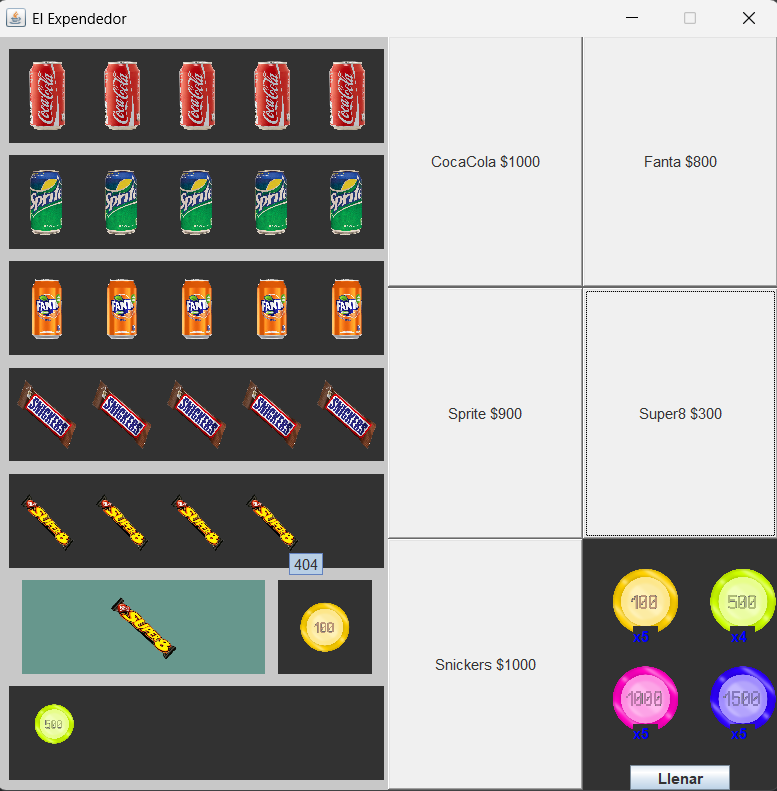

# Logica.Expendedor

# nombres:
    Antonella Francisca Pincheira Poblete
    Pablo Benjamin Vargas Pino

# Funcionamiento:
    Al clickear una moneda se elige el producto a comprar, si no es suficiente no permite hacer la compra. 
    Al pasar por sobre un objeto en un deposito, podemos ver el número de serie.
    Si hacemos click en el deposito de monedas, estas se ordenan de menor a mayor valor.
    Si hacemos click en uno de los depositos de productos estos se llenan.
    Si nos quedamos sin monedas podemos rellenar nuestro monedero.

